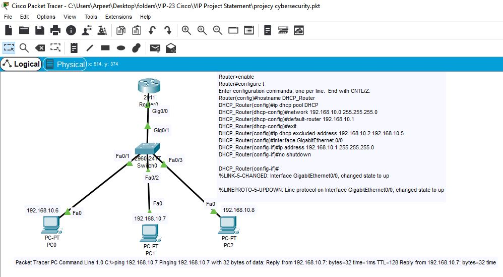
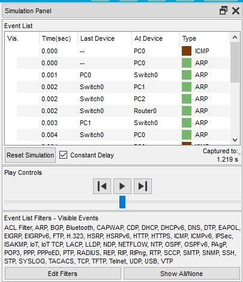

# Cybersecurity Packet Flow Visualization

## Project Overview
This project demonstrates packet flow monitoring, cybersecurity traffic analysis, and network visualization using Cisco Packet Tracer. The project focuses on understanding how packets travel across networks, identifying communication patterns, and analyzing cybersecurity-related traffic behavior.

---

## Objectives
- Understand packet flow in computer networks
- Simulate network communication using Cisco Packet Tracer
- Analyze packet transmission between systems
- Visualize traffic movement and protocol behavior
- Learn cybersecurity monitoring and network analysis concepts

---

## Features
- Packet flow simulation
- Network topology design
- Packet inspection and protocol analysis
- Traffic visualization
- Cybersecurity-focused network analysis
- Router and switch configuration
- End-device communication monitoring

---

## Technologies & Tools Used
- Cisco Packet Tracer
- Networking Fundamentals
- Cybersecurity Concepts
- Packet Analysis
- Routing & Switching
- OSI Model
- TCP/IP Protocol Suite

---

## Project Components
### Included in Repository
- Cisco Packet Tracer simulation files
- Network topology diagrams
- Screenshots and figures
- Tables and documentation
- Packet flow analysis
---

---

## Project Screenshots

### Network Topology & Router Switch Configuration

### Packet Flow Simulation & Traffic Analysis

---

## Certifications & Badges

- Cybersecurity Essentials – Cisco
- Cyber Ops Associate – Cisco
- Introduction to Cybersecurity – Cisco
- CCSK v4.1 Foundation Training – Cloud Security Alliance

---

## Certifications Related to This Project
### Cisco Certifications
1. Cybersecurity Essentials — Cisco (Issued: September 2023)
2. Cyber Ops Associate — Cisco (Issued: July 2023)
3. Introduction to Cybersecurity — Cisco (Issued: May 2023)

---

## Learning Outcomes
- Practical understanding of packet transmission
- Network traffic monitoring
- Cybersecurity analysis basics
- Protocol behavior analysis
- Network troubleshooting
- Simulation-based cybersecurity learning

---

## Future Improvements
- Real-time packet monitoring
- Intrusion detection simulation
- Traffic anomaly detection
- Advanced network security implementation
- SIEM integration concepts

---

## Author
Arpeet Bhaisare

B.Tech – Electronics & Communication Engineering  
Indian Institute of Information Technology (IIIT) Bhopal

LinkedIn:
https://www.linkedin.com/in/arpeet-bhaisare-a02a061ba

GitHub:
https://github.com/Arpeet-Bhaisare
